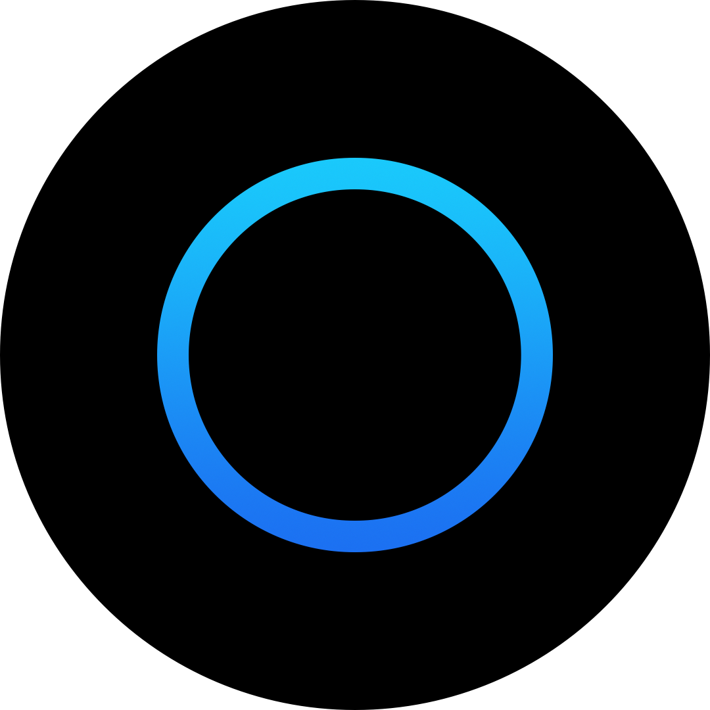

  

<h1 align="center">Orbitaly</h1>

  
  
  

  

Orbitaly is an independent Matrix homeserver and ecosystem for people who want modern messaging without platform lock-in.

Instead of one closed app controlling everything, Orbitaly gives you a sovereign Matrix identity (`@username:chat.orbitaly.de`) that works across compatible clients.

This repository contains the official Orbitaly website and landing page.

- Repository: [github.com/levo-studio/orbitaly](https://github.com/levo-studio/orbitaly)
- Homeserver: [chat.orbitaly.de](https://chat.orbitaly.de)

## What Orbitaly Is

Orbitaly is a Matrix homeserver operated by Levo Studio.

That means:

- Your account identity is hosted on Orbitaly
- You are free to choose your preferred Matrix client
- You can communicate across the wider Matrix network

Orbitaly currently does not ship a dedicated custom client yet.

## Why Matrix

Matrix is an open communication protocol.

Like email, different clients and servers can communicate with each other.
This allows interoperability, long-term portability, and less dependence on a single provider.

## Your Orbitaly ID

After registration, your Matrix ID looks like this:

`@yourname:chat.orbitaly.de`

This full identifier is what other people use to find and add you.

## Start Using Orbitaly

1. Open any Matrix client
2. Use homeserver URL: `https://chat.orbitaly.de`
3. Create an account or sign in
4. Share your Matrix ID with friends, communities, or teams

Recommended clients:

- [Element Web](https://app.element.io)
- [FluffyChat Web](https://fluffychat.im/web)
- [Cinny Web](https://app.cinny.in)
- [NeoChat](https://apps.kde.org/neochat/)

## Privacy & Infrastructure

- Hosted in Germany (Falkenstein)
- GDPR/DSGVO-oriented operation
- End-to-end encrypted Matrix rooms available where supported and enabled
- Privacy-focused, but not anonymous by default

## Project Status

Orbitaly is live and continuously evolving.

Current focus areas:

- Better onboarding
- Invite-based access flow
- Extended Orbitaly web experience

## Tech Stack (Website)

- Next.js (App Router)
- TypeScript
- Tailwind CSS
- shadcn/ui
- Framer Motion
- GSAP ScrollTrigger
- lucide-react

## License

This project is currently released under a proprietary license.
See [LICENSE](./LICENSE) for full terms.

## Copyright

Copyright (c) Levo Studio
Copyright (c) Julius Grimm
All rights reserved.

---

Developed with ❤️ by Julius Grimm
