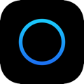

<p align="center">
  
</p>

<h1 align="center">Orbitaly</h1>

<p align="center"><strong>Independent Matrix-based communication.</strong></p>

<h2 align="center"><strong>A PRODUCT BY LEVO STUDIO</strong></h2>

Orbitaly is a private, independent Matrix-based communication platform for friend groups, communities, and teams that want more control than closed social apps.

This repository contains the official Orbitaly website and landing page.

- Public repository: [github.com/levo-studio/orbitaly](https://github.com/levo-studio/orbitaly)
- Homeserver: [chat.orbitaly.de](https://chat.orbitaly.de)

## What Orbitaly Is

Orbitaly is a Matrix homeserver.

That means your account identity lives on Orbitaly, while you choose your preferred Matrix client.

Orbitaly currently does **not** have its own custom client.

## Matrix in One Minute

Matrix is an open communication protocol.

Like email, different apps and different servers can still interoperate on one shared network.

- Closed platforms: one provider controls identity, policy, and ecosystem rules
- Matrix: open protocol, independent servers, user choice, interoperability

## Your Matrix ID

When you create an account on Orbitaly, your ID looks like:

`@yourname:chat.orbitaly.de`

This full ID is how people add you as a contact in Matrix clients.

## Start Using Orbitaly

1. Open a Matrix client
2. Enter homeserver URL: `https://chat.orbitaly.de`
3. Create account or sign in
4. Share your Matrix ID (`@user:chat.orbitaly.de`) so others can find you

Recommended clients:

- [Element Web](https://app.element.io)
- [FluffyChat Web](https://fluffychat.im/web)
- [Cinny Web](https://app.cinny.in)

## Infrastructure & Privacy Notes

- Hosted in Germany (Falkenstein)
- DSGVO/GDPR-oriented operation
- Native Matrix encrypted rooms can protect message content end-to-end when enabled
- Privacy-focused, not anonymous by default

## Project Status

Orbitaly is live and evolving.

Current focus:

- Better onboarding flow
- Invite-oriented access and setup UX
- Custom Orbitaly web experience

## Stack (Website)

- Next.js (App Router)
- TypeScript
- Tailwind CSS
- shadcn/ui
- Framer Motion
- GSAP ScrollTrigger
- lucide-react

## Local Development

```bash
pnpm install
pnpm dev
```

---

Orbitaly — Independent communication · Open protocol · Your orbit  
Made with ❤️ in Germany by Julius
